# Database ERD - Web Portal

> Terakhir diperbarui: **14 Januari 2026** (setelah efisiensi 5 tabel dihapus)

## Total Tabel: 17

```mermaid
erDiagram
    %% ========================
    %% USERS & AUTHENTICATION
    %% ========================
    users {
        bigint id PK
        string name
        string email UK
        timestamp email_verified_at
        string password
        string role "super_admin|admin|editor|author|member"
        string profile_photo
        string phone
        string position
        text bio
        string location
        timestamp last_login_at
        string last_login_ip
        int failed_login_count
        timestamp locked_until
        string remember_token
        timestamp deleted_at
        timestamps created_at
        timestamps updated_at
    }

    otp_codes {
        bigint id PK
        bigint user_id FK
        string email
        string code
        string type "password_reset|login_2fa|email_verification"
        boolean is_used
        timestamp expires_at
        timestamps created_at
        timestamps updated_at
    }

    personal_access_tokens {
        bigint id PK
        string tokenable_type
        bigint tokenable_id
        string name
        string token UK
        text abilities
        timestamp last_used_at
        timestamp expires_at
        timestamps created_at
        timestamps updated_at
    }

    sessions {
        string id PK
        bigint user_id FK
        string ip_address
        text user_agent
        longtext payload
        int last_activity
    }

    %% ========================
    %% CONTENT MANAGEMENT
    %% ========================
    articles {
        bigint id PK
        string title
        string slug UK
        text excerpt
        longtext content
        string thumbnail
        string category
        bigint category_id FK
        int read_time
        string status "draft|pending|published|rejected"
        string security_status
        text security_message
        text security_detail
        bigint author_id FK
        string meta_title
        text meta_description
        text meta_keywords
        int views
        timestamp published_at
        timestamp deleted_at
        timestamps created_at
        timestamps updated_at
    }

    categories {
        bigint id PK
        string name
        string slug UK
        text description
        string color
        string icon
        int sort_order
        boolean is_active
        timestamp deleted_at
        timestamps created_at
        timestamps updated_at
    }

    tags {
        bigint id PK
        string name UK
        string slug UK
        boolean is_active
        timestamps created_at
        timestamps updated_at
    }

    article_tag {
        bigint id PK
        bigint article_id FK
        bigint tag_id FK
        timestamps created_at
        timestamps updated_at
    }

    galleries {
        bigint id PK
        string title
        text description
        string image_path
        string thumbnail_path
        string media_type "image|video"
        string video_url
        string album
        date event_date
        string location
        boolean is_featured
        boolean is_published
        int sort_order
        bigint uploaded_by FK
        timestamp published_at
        timestamp deleted_at
        timestamps created_at
        timestamps updated_at
    }

    %% ========================
    %% ARTICLE INTERACTIONS
    %% ========================
    article_comments {
        bigint id PK
        bigint article_id FK
        bigint user_id FK
        bigint parent_id FK "self-reference for replies"
        text content
        string status "visible|hidden|spam"
        timestamp deleted_at
        timestamps created_at
        timestamps updated_at
    }

    article_likes {
        bigint id PK
        bigint article_id FK
        bigint user_id FK
        timestamps created_at
        timestamps updated_at
    }

    %% ========================
    %% SYSTEM & MONITORING
    %% ========================
    activity_logs {
        bigint id PK
        bigint user_id FK
        string action
        string target_type
        bigint target_id
        text description
        json old_values
        json new_values
        string ip_address
        text user_agent
        timestamp deleted_at
        timestamps created_at
        timestamps updated_at
    }

    blocked_clients {
        bigint id PK
        string ip_address
        text user_agent
        int attempts
        boolean is_blocked
        int block_duration
        text reason
        json blocked_routes
        timestamp blocked_until
        timestamps created_at
        timestamps updated_at
    }

    site_settings {
        bigint id PK
        string key UK
        longtext value
        string group
        string type
        text description
        timestamps created_at
        timestamps updated_at
    }

    %% ========================
    %% LARAVEL SYSTEM TABLES
    %% ========================
    cache {
        string key PK
        mediumtext value
        int expiration
    }

    cache_locks {
        string key PK
        string owner
        int expiration
    }

    migrations {
        int id PK
        string migration
        int batch
    }

    %% ========================
    %% RELATIONSHIPS
    %% ========================
    users ||--o{ articles : "author_id"
    users ||--o{ galleries : "uploaded_by"
    users ||--o{ activity_logs : "user_id"
    users ||--o{ otp_codes : "user_id"
    users ||--o{ article_comments : "user_id"
    users ||--o{ article_likes : "user_id"
    users ||--o{ sessions : "user_id"
    users ||--o{ personal_access_tokens : "tokenable_id"
    
    categories ||--o{ articles : "category_id"
    
    articles ||--o{ article_tag : "article_id"
    tags ||--o{ article_tag : "tag_id"
    
    articles ||--o{ article_comments : "article_id"
    articles ||--o{ article_likes : "article_id"
    
    article_comments ||--o{ article_comments : "parent_id (replies)"
```

---

## Ringkasan Relasi

| Tabel Utama | Relasi | Tabel Terkait |
|-------------|--------|---------------|
| `users` | 1:N | `articles`, `galleries`, `activity_logs`, `otp_codes`, `article_comments`, `article_likes`, `sessions`, `personal_access_tokens` |
| `categories` | 1:N | `articles` |
| `articles` | N:M | `tags` (via `article_tag`) |
| `articles` | 1:N | `article_comments`, `article_likes` |
| `article_comments` | 1:N | `article_comments` (replies) |

---

## Catatan Efisiensi

> [!NOTE]
> **5 Tabel Dihapus (14 Jan 2026):**
> - ~~`failed_jobs`~~ - Queue tidak digunakan
> - ~~`job_batches`~~ - Queue tidak digunakan
> - ~~`jobs`~~ - Queue tidak digunakan
> - ~~`password_reset_tokens`~~ - Diganti dengan sistem OTP
> - ~~`pages`~~ - Tidak ada controller/route/view yang menggunakan
